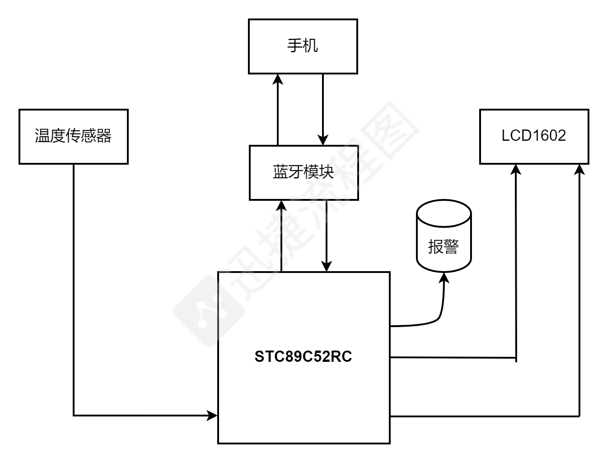

# 基于STC89C52RC做的一个蓝牙温控显示和一个音乐播放器
本项目的流程为，先实现读取DS18B20模块数据，送给LCD1602模块显示，再之后就是最困难的通信模块构建，本次是基于蓝牙模块实现单片机同上位机（安卓手机）之间的通信，这就需要考虑到它们之间波特率的问题，由于此次实验通过的单片机晶振是12Mhz，12Mhz晶振通信起来误差是非常大的，这是由于其并计算初值时存在的误差。而市面上的蓝牙模块其默认波特率大都为9600，采用9600波特率，单片机根本无法同蓝牙模块建立稳定的通信，所以就要求使用AT指令调整波特率，调整到4800，并且波特率翻倍的情况下才能实现误差为0.16%的通信，较为可靠。

